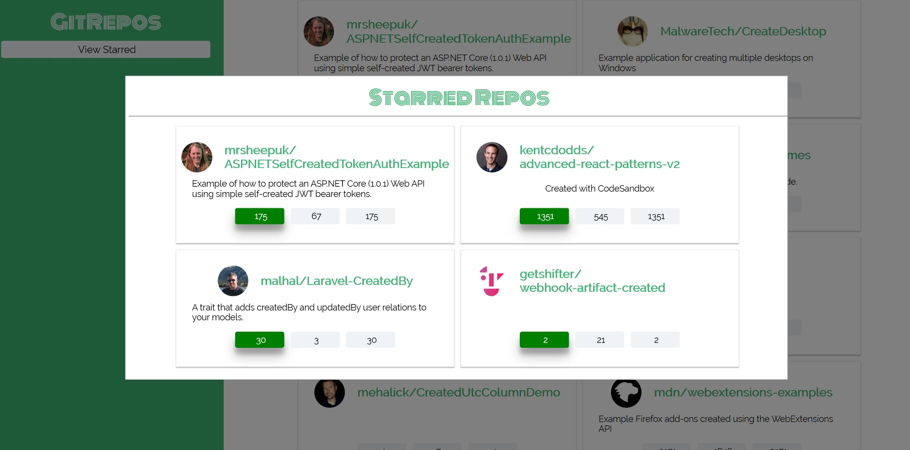

# react-redux-repo-list

A simple React application consuming the GitHub API with plain HTTP requests. [Read more about it over here](https://api.github.com/search/repositories?q=created).

## Features

* React 16 with create-react-app
* GitHub API
* Consuming with plain JS
* Maintain Redux state

## Installation

* `git clone https://github.com/sndp-vrma/repo-names.git`
* cd repo-names
* npm install
* [add your own REACT_APP_GITHUB_PERSONAL_ACCESS_TOKEN in .env file](https://help.github.com/articles/creating-a-personal-access-token-for-the-command-line/)
* scopes/permissions you need to check: admin:org, repo, user, notifications
* npm start
* visit `http://localhost:3000`